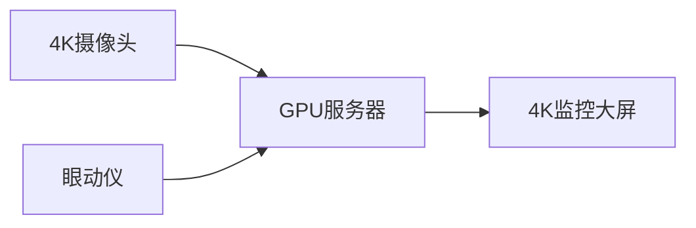

# 👁️ 基于视线追踪的飞行员疲劳状态智能评估数字孪生平台

  
*图1：动态数据监控大屏（多模态数据融合可视化）*

## 📌 项目简介

**中国人民解放军空军特色医学中心**主导开发的智能评估平台，通过高精度视线追踪与深度学习技术，实时监测飞行员疲劳状态，降低航空作业风险。核心功能包括：
- 🎯 视线追踪精度≤1.0° @60Hz
- 🚨 多级疲劳预警（PERCLOS/眨眼频率/视线稳定性）
- 🖥️ 三维数字孪生驾驶舱实时映射
- 📊 多维度数据分析与报告生成

  
*图2：三维孪生驾驶舱中的视线追踪效果*

---

## 🛠️ 核心功能

### 1. 实时监测系统
- **动态脉冲光圈**标记注视焦点（图3）
- **热力图**分析5分钟内视觉停留分布
- **疲劳度环形仪表盘**（0-100分分级预警）

  
*图3：动态光圈标识注视区域*

### 2. 离线分析模块
```python
# 示例代码：快速分析模式配置
analysis_config = {
    "mode": "fast",  # 或 "deep"（深度分析）
    "metrics": ["PERCLOS", "blink_rate"],
    "data_source": "flight_CA1234_20230815.zip"
}
```

### 3. 预警处理流程
| 预警级别 | 触发条件 | 系统响应 |
|----------|----------|----------|
| 黄色预警 | 评分31-70分 | 弹窗提示+语音提醒 |
| 红色预警 | 评分≥71分 | 自动锁定数据+蜂鸣警报 |

  
*图4：疲劳评分与关键指标面板*

---

## ⚙️ 技术架构

### 硬件要求


### 软件依赖
- **深度学习框架**: PyTorch 1.9.0 + CUDA 11.2
- **数据库**: MySQL 8.0 + MongoDB 4.4
- **可视化**: Three.js r128

---

## 🚀 快速开始

1. **登录系统**  
     
   *使用工号/邮箱+SC智能卡认证*

2. **启动监测**
   ```bash
   # 设备连接检查（示例）
   $ python check_devices.py --camera --eyetracker
   ```

3. **查看报告**
   ```markdown
   📂 报告生成路径：
   /reports/CA1234_20230815_fatigue.pdf
   ```

---

## 📜 权限管理矩阵

| 角色       | 实时监测 | 历史数据 | 系统配置 |
|------------|----------|----------|----------|
| 飞行员     | ✓（仅自己） | ✓（30天内） | ×        |
| 航医       | ✓（负责机组） | ✓（全部） | ×        |
| 管理员     | ✓（全部）   | ✓（全部） | ✓        |

  
*图5：角色权限配置界面*

---

## 📎 相关资源
- [技术白皮书](docs/whitepaper.pdf)
- [硬件配置指南](docs/hardware_setup.md)
- [航空医学标准AC 120-100](docs/FAA_AC120-100.pdf)

---

## 📧 联系我们
**空军特色医学中心人工智能实验室**  
✉️ aviation-ai@plaaf.mil.cn  
☎️ +86-10-6691XXXX（军线）
``` 

> 💡 **设计说明**：  
> 1. 采用军事科技风格配色（深蓝/警示红）  
> 2. 关键功能均附带示意图或代码片段  
> 3. 权限管理部分使用表格+图示双重说明  
> 4. 所有图片路径需替换为实际仓库media目录文件
