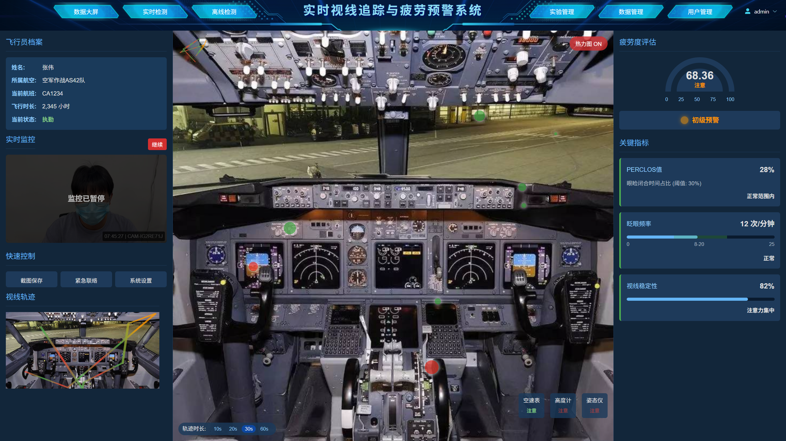
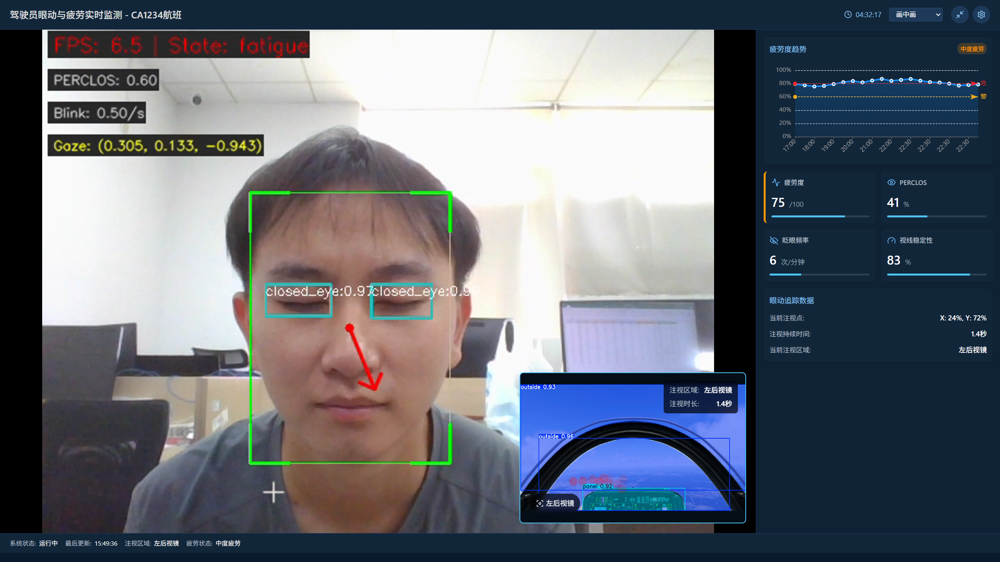
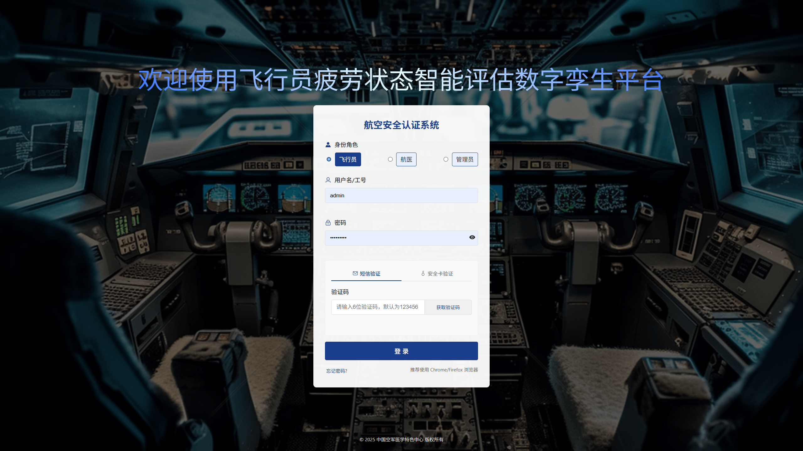

# 👁️ 基于视线追踪的飞行员疲劳状态智能评估数字孪生平台

  
*图1：动态数据监控大屏*

## 📌 项目简介

基于第十九届“挑战杯·揭榜挂帅”擂台赛中**中国人民解放军空军特色医学中心**
发布的榜题要求，开发了一套智能评估平台。该平台采用高精度视线追踪技术与深度学习算法，可实时监测飞行员疲劳状态，以望降低航空作业风险。

- 🎯 视线追踪
- 🚨 多级疲劳预警
- 🖥️ 三维数字孪生驾驶舱
- 📊 多维度数据分析与报告生成

  
*图2：实时监测界面*
---

## 🚀 快速开始

1. **安装依赖**
   ```shell
   npm install
   ```
2. **启动项目**
   ```shell
   npm run dev
   ```
3. **登录系统**  
     
   *请使用专用工号/邮箱，进行验证后再使用系统*

---

## 🛠️ 核心功能

| 功能模块     | 功能介绍                            |
|----------|---------------------------------|
| **实时检测** | 实时高精度眼动追踪与疲劳状态分析                |
| **离线检测** | 支持历史视频/眼动数据分析，提供快速/深度两种处理模式     |
| **大屏监控** | 三视图驾驶舱数字孪生，动态热力图可视化注视轨迹         |
| **实验管理** | 实现历史实验管理，支持多条件查询                |
| **数据管理** | 通过数据统计面板展示眼动类型分布、疲劳指数，并支持实验报告生成 |
| **权限管理** | 基于角色访问控制，实现权限分配与使用，以及权限申请与审计    |

---

## ⚙️ 技术架构

### 软件依赖

- **深度学习框架**: PyTorch 2.4.1 + CUDA 12.1
- **数据库**: MySQL 8.0 + MongoDB 4.4
- **可视化**: Three.js

---

## 📧 联系我们

**A533实验室**  
✉️ lyx_07@cumt.edu.cn  
📱 +86 18689267229
